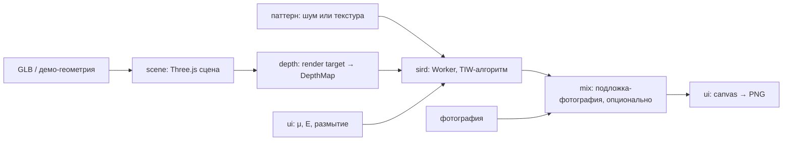

# Архитектура

> Источник правды по тому, как устроена система и почему именно так. Правки
> кода, меняющие модули или потоки данных, обязаны обновлять этот файл в
> том же PR.

## 1. Компоненты системы

Всё работает в браузере, серверной части нет.

| Компонент | Ответственность | Папка | Технология |
|---|---|---|---|
| scene | Загрузка 3D-модели, сцена, камера, вращение мышью | `src/scene/` | Three.js, GLTFLoader, OrbitControls |
| depth | Рендер сцены в карту глубины и её нормализация | `src/depth/` | Three.js render target + свой ShaderMaterial |
| sird | Генерация автостереограммы из карты глубины и паттерна | `src/sird/` | чистый JS, ImageData; кадр считается полосами в пуле Web Worker'ов (ADR-004) |
| mix | Фотография подложкой поверх готового кадра (ADR-005) | `src/mix/` | чистый JS, RGBA |
| ui | Контролы параметров, превью, экспорт PNG | `src/ui/` | vanilla DOM, Canvas 2D |

## 2. Точки интеграции

- **scene → depth:** `depth` получает готовые `THREE.Scene` и
  `THREE.Camera` и рендерит их с override-материалом. `depth` не знает, откуда
  взялась модель.
- **depth → sird:** через `DepthMap` (см. `docs/api_contracts.md`) —
  типизированный массив + размеры. Это главная граница проекта: `sird` не
  импортирует Three.js. Передача в Worker — через `postMessage` с transfer
  буфера.
- **sird → mix → ui:** `ImageData` того же размера; `ui` рисует его в
  canvas и экспортирует через `canvas.toBlob`. В режиме «фото подложкой»
  кадр по дороге умножается на размытую фотографию (`mix/`, ADR-005) —
  генератор про этот шаг не знает, контракт `sird/` от него не зависит.
- **Внешние сервисы:** нет. Приложение работает офлайн после загрузки.

## 3. Поток данных (ключевой сценарий)

Пользователь загружает GLB → крутит модель → жмёт «сгенерировать» → видит
стереограмму → скачивает PNG.

Детали шагов:

1. **scene.** Модель центрируется и масштабируется в единичный bounding
   box, чтобы параметры глубины не зависели от масштаба исходного файла.
2. **depth.** Сцена рендерится в `WebGLRenderTarget` с
   override-материалом, который пишет линейную глубину камеры. Затем
   диапазон нормализуется по фактическим min/max модели в кадре (не по
   near/far камеры, иначе рельеф схлопывается). Фон получает значение 0
   («дальше всего»); опциональный `floor` укладывает модель в `[floor, 1]`,
   чтобы у силуэта осталась ступенька и предмет читался перед фоном, а не
   холмом на стене. Опционально — box-размытие, потому что стереограмма
   плохо передаёт резкие изломы рельефа; фон в усреднении не участвует,
   поэтому силуэт остаётся резким (окклюзию на нём обрабатывает `sird`).
3. **sird.** Алгоритм Thimbleby, Inglis, Witten («Displaying 3D Images:
   Algorithms for Single Image Random Dot Stereograms», 1994). Для каждого
   пикселя строки считается сепарация `sep(z) = round(E · (1 − μz) / (2 − μz))`,
   строится массив ссылок `same[x]` с учётом окклюзии, затем строка
   раскрашивается: пиксель со ссылкой копирует цвет пары, без ссылки —
   берёт из паттерна. Режим перекрёстного взгляда = инверсия `z`. Строки
   независимы, поэтому кадр делится на горизонтальные полосы по числу
   ядер и считается параллельно (ADR-004).
4. **ui.** Слайдеры меняют параметры и перезапускают генерацию (с
   дебаунсом); превью карты глубины показывается рядом для отладки. Во
   время вращения модели считается черновик в уменьшенном масштабе, после
   остановки — итоговый кадр пиксель в пиксель.

## 4. Инварианты (нарушение = баг)

- `src/sird/` не импортирует Three.js и ничего из `src/scene/`,
  `src/depth/`. Он должен работать на синтетической карте глубины из теста.
- Значение глубины 0 всегда означает «фон / самая дальняя точка», 1 —
  «ближе всего к зрителю». Инверсия для перекрёстного взгляда делается
  внутри `sird` по флагу, а не подменой карты снаружи.
- Ширина карты глубины и ширина стереограммы совпадают; ресайз делается до
  генератора, не внутри.

## 5. Открытые архитектурные вопросы

- Как калибровать E под физический размер пикселя (DPI) — спросить у
  пользователя диагональ экрана или дать ползунок «пока не сойдётся»?
  Частично закрыто: дефолты подняты до `E=180`, `μ=0.45` — владелец подобрал
  их глазами на стенде (см. `docs/api_contracts.md`, п.2). Замеры попутно
  показали, что у вопроса есть вторая сторона, не только удобство сведения:
  сепарация округляется до целых пикселей, поэтому число ступеней рельефа
  `≈ E·μ / (2(2−μ)) + 1` — на старых `E=90`, `μ=1/3` их было 10 и гладкая
  сфера читалась террасами, на новых 27. Автоматическая калибровка под DPI
  по-прежнему открыта: подобранное число верно для монитора владельца, а на
  экране с сильно другим размером пикселя E придётся менять. Пока лечится
  ползунком.
- ~~Нужна ли стереограмма в реальном времени при вращении (GPU-генератор)~~
  Закрыто: понадобилась, но сделана без GPU — пул воркеров по строкам плюс
  черновик уменьшенного масштаба (ADR-004). GPU-генератор так и не нужен.
